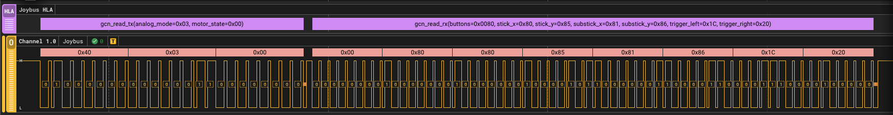
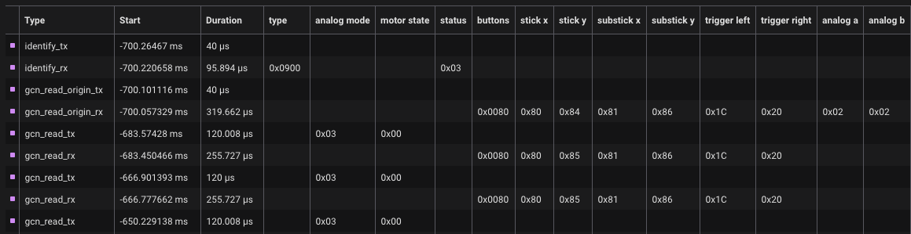

# Joybus Analyzers for Saleae Logic2

Saleae Logic2 analyzers for decoding the Joybus protocol used by Nintendo 64 and GameCube consoles and controllers.




## Low-Level Analyzer

The Joybus Low-Level Analyzer decodes the raw signal from the Joybus protocol into "byte" frames and "stop" frames.

## High-Level Analyzer

The Joybus High-Level Analyzer decodes the frames produced by the Low-Level Analyzer into human-readable transactions. The Low-Level Analyzer must be installed and active for the High-Level Analyzer to function.

## Building the Low-Level Analyzer

```sh
cmake -B build && cmake --build build
```

Full details on building Saleae Low Level Analyzers can be found in the [SampleAnalyzer README](https://github.com/saleae/SampleAnalyzer).
